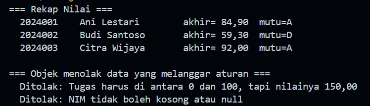
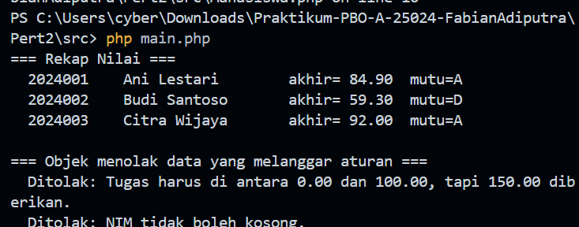

# Praktikum PBO — Pertemuan 2

## Biodata Saya

| Keterangan | Data |
|---|---|
| Nama | Fabian Adiputra |
| NIM | 4525210024 |
| Kelas | PBO A |

## Tugasnya Apa

Pada tugas Pertemuan 2 ini, saya membuat kelas `Mahasiswa` untuk menerapkan
enkapsulasi dan menjaga invariant data. Data mahasiswa terdiri dari NIM, nama,
nilai tugas, UTS, dan UAS. Program menghitung nilai akhir dengan bobot tugas
30%, UTS 30%, dan UAS 40%, lalu menentukan huruf mutu berdasarkan nilai akhir.

Program juga harus menolak data yang tidak valid:

- NIM tidak boleh kosong.
- Nilai tugas, UTS, dan UAS harus berada pada rentang 0 sampai 100.
- Data dan perilaku kelas disediakan melalui atribut privat serta method yang
  sesuai, tanpa menyediakan setter untuk NIM.

Tugas dikerjakan dalam dua implementasi, yaitu Java dan PHP.

## Source Tugas yang Saya Kerjakan

### File `Mahasiswa.java`

#### Sebelum

Pada kode awal, bagian deklarasi atribut dan beberapa method ditandai sebagai
`TODO`. Tugasnya adalah menentukan atribut yang dapat berubah, melengkapi
constructor, menambahkan validasi nilai, menghitung nilai akhir dan huruf mutu,
serta menyediakan getter yang diperlukan.

#### Setelah

Source: [src/Mahasiswa.java](src/Mahasiswa.java)

Kelas `Mahasiswa` menyimpan NIM dan nama sebagai atribut privat `final`, serta
menyimpan nilai tugas, UTS, dan UAS sebagai atribut privat. Constructor menolak
NIM yang kosong dan memeriksa setiap nilai melalui method pembantu
`pastikanNilaiSah`. Method `nilaiAkhir()` menghitung nilai berbobot, sedangkan
`hurufMutu()` menentukan nilai A sampai E. Getter menyediakan akses terbatas
terhadap data yang diperlukan.

### File `Main.java`

#### Sebelum

Kode awal menyediakan kerangka program utama. Bagian yang perlu dilengkapi
adalah pembuatan objek mahasiswa, pencetakan rekap, serta pengujian bahwa objek
menolak data yang melanggar aturan.

#### Setelah

Source: [src/Main.java](src/Main.java)

Program membuat tiga objek mahasiswa dan mencetak nilai akhir beserta huruf
mutunya. Program kemudian mencoba membuat objek dengan nilai di atas 100 dan
NIM kosong. Kedua kondisi tersebut ditangani dengan `IllegalArgumentException`
dan pesan penolakan ditampilkan.

### File `Mahasiswa.php`

#### Sebelum

Seperti versi Java, kode awal berisi beberapa `TODO` untuk melengkapi atribut,
validasi NIM dan nilai, perhitungan nilai akhir, penentuan huruf mutu, serta
getter.

#### Setelah

Source: [src/Mahasiswa.php](src/Mahasiswa.php)

Implementasi PHP memiliki konstanta bobot dan batas nilai, memvalidasi NIM
serta setiap komponen nilai pada constructor, menghitung nilai akhir, dan
menentukan huruf mutu. Atribut dibuat privat melalui constructor property
promotion, dan method getter maupun `__toString()` digunakan untuk menampilkan
data objek.

### File `main.php`

#### Sebelum

Kerangka program perlu menjalankan contoh penggunaan kelas `Mahasiswa` dan
menguji penolakan data yang tidak valid.

#### Setelah

Source: [src/main.php](src/main.php)

Program menampilkan rekap tiga mahasiswa. Selanjutnya, program mencoba
membuat objek dengan nilai tugas 150 dan objek dengan NIM kosong. Exception
yang dihasilkan ditangkap dan pesan penolakan ditampilkan.

## Hasil Keseluruhan

### Hasil menjalankan program Java

### Hasil menjalankan program PHP

## Kesimpulan

Dari tugas ini, saya mempelajari bahwa enkapsulasi membantu membatasi akses
langsung terhadap data objek, sedangkan validasi pada constructor menjaga agar
objek hanya dibuat dengan data yang sesuai aturan. Perhitungan nilai akhir
menggunakan konstanta bobot dan method penentu huruf mutu membuat proses rekap
lebih terstruktur. Implementasi Java dan PHP menghasilkan perilaku yang sama
untuk data valid maupun data yang harus ditolak.
