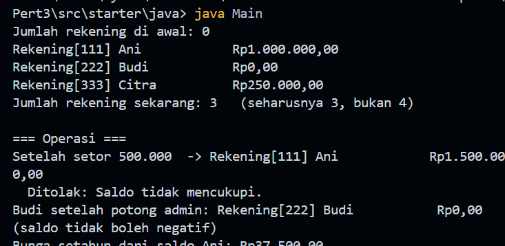
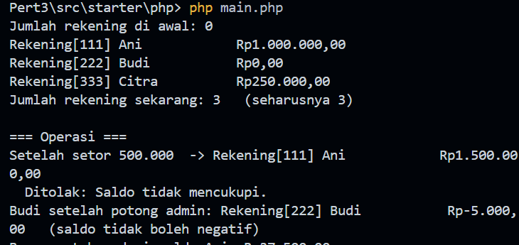

# Praktikum PBO — Pertemuan 3

## Biodata Saya

| Keterangan | Data            |
| ---------- | --------------- |
| Nama       | Fabian Adiputra |
| NIM        | 4525210024      |
| Kelas      | PBO A           |

## Tugasnya Apa

Pada praktikum ini, saya membuat kelas `RekeningBank` untuk mempelajari
constructor, constructor berdelegasi, named constructor, anggota statis, dan
konstanta. Setiap rekening mempunyai nomor, nama pemilik, dan saldo. Program
mendukung setoran, penarikan, pemotongan biaya administrasi, serta perhitungan
bunga tahunan.

Aturan utama yang diterapkan:

- Nomor rekening tidak boleh kosong dan saldo awal tidak boleh negatif.
- Setoran dan penarikan harus bernilai positif.
- Penarikan tidak boleh melebihi saldo atau batas transaksi sebesar
  Rp5.000.000.
- Jumlah rekening dihitung menggunakan anggota statis.
- Bunga tahunan, biaya administrasi, dan batas penarikan disimpan sebagai
  konstanta bernama.
- Constructor Java yang ringkas mendelegasikan pembuatan objek ke constructor
  lengkap. PHP menggunakan named constructor `rekeningPelajar()` sebagai
  padanan constructor tambahan.

Tugas ini memiliki implementasi Java dan PHP. Keduanya menggunakan aturan
rekening yang sama, dengan penyesuaian pada cara masing-masing bahasa
mendukung constructor.

## Source Tugas yang Saya Kerjakan

### File `RekeningBank.java`

#### Sebelum

File starter berisi beberapa bagian `TODO`. Saya diminta melengkapi konstanta,
field statis penghitung rekening, delegasi dari constructor ringkas ke
constructor lengkap, validasi data, operasi rekening, dan method statis untuk
menghitung bunga.

#### Setelah

Source: [src/starter/java/RekeningBank.java](src/starter/java/RekeningBank.java)

Kelas ini menyimpan nomor dan pemilik rekening sebagai atribut yang tidak
diubah setelah objek dibuat, sedangkan saldo dapat berubah melalui operasi
rekening. Constructor dua argumen memanggil constructor tiga argumen dengan
`this(...)`, sehingga validasi dan penambahan penghitung rekening hanya
dilakukan pada satu tempat. Method `setor()` dan `tarik()` memeriksa jumlah
transaksi sebelum mengubah saldo. `potongBiayaAdmin()` memastikan saldo tidak
menjadi negatif.

### File `Main.java`

#### Sebelum

File program utama disediakan untuk mencoba pembuatan rekening dan operasinya.
Saya menggunakan program ini untuk memeriksa constructor, penghitung jumlah
rekening, penolakan transaksi yang tidak sah, dan perhitungan bunga.

#### Setelah

Source: [src/starter/java/Main.java](src/starter/java/Main.java)

Program membuat tiga rekening dengan dua bentuk constructor, menampilkan
jumlah rekening, lalu mencoba setoran dan penarikan. Program juga menunjukkan
penolakan penarikan yang tidak memenuhi batas dan mencetak bunga setahun dari
saldo rekening Ani.

### File `RekeningBank.php`

#### Sebelum

File starter memiliki bagian `TODO` untuk konstanta, penghitung statis,
validasi constructor, named constructor rekening pelajar, dan method statis.
PHP tidak mendukung constructor overloading seperti Java, sehingga pembuatan
rekening pelajar dilakukan melalui static factory.

#### Setelah

Source: [src/starter/php/RekeningBank.php](src/starter/php/RekeningBank.php)

Kelas ini menggunakan default parameter untuk saldo awal dan method
`rekeningPelajar()` untuk membuat rekening bersaldo nol. Constructor memeriksa
nomor serta saldo awal, lalu menaikkan penghitung rekening. Konstanta digunakan
untuk bunga tahunan, biaya administrasi, dan batas penarikan. Properti
`$nomor` dan `$pemilik` tidak memiliki setter publik, sementara operasi saldo
tersedia melalui method kelas.

**Catatan hasil:** implementasi `potongBiayaAdmin()` pada file PHP saat ini
langsung mengurangi biaya dari saldo. Karena itu saldo Budi yang semula nol
menjadi negatif Rp5.000. Berbeda dengan versi Java, method PHP ini belum
menerapkan perlindungan agar saldo tidak negatif.

### File `main.php`

#### Sebelum

File program utama digunakan sebagai penguji kelas PHP. Program perlu
menampilkan rekening dan hasil operasi, serta mencoba transaksi yang
seharusnya ditolak.

#### Setelah

Source: [src/starter/php/main.php](src/starter/php/main.php)

Program membuat rekening Ani, Budi melalui named constructor, dan Citra.
Program kemudian mencetak jumlah rekening, melakukan setoran dan percobaan
penarikan yang melebihi batas, memotong biaya administrasi Budi, serta
menghitung bunga tahunan rekening Ani.

## Hasil Keseluruhan

### Hasil menjalankan program Java

### Hasil menjalankan program PHP

## Kesimpulan

Melalui tugas ini, saya mempelajari bahwa constructor dapat digunakan untuk
memvalidasi kondisi awal objek, dan constructor berdelegasi membantu mencegah
duplikasi aturan. Anggota statis digunakan untuk data bersama seperti jumlah
rekening, sedangkan konstanta memberi nama yang jelas pada nilai tetap.
Implementasi Java dan PHP memiliki tujuan yang sama, tetapi perbedaan fitur
bahasa memengaruhi cara membuat constructor alternatif. Saya juga melihat
pentingnya menguji setiap operasi terhadap invariant, termasuk memastikan
saldo tidak menjadi negatif setelah biaya administrasi dipotong.
