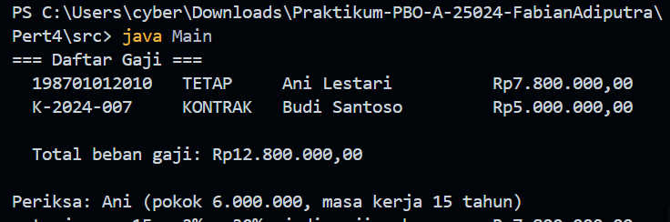
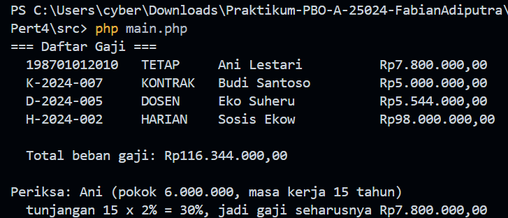

# Praktikum PBO — Pertemuan 4

## Biodata Saya

| Keterangan | Data            |
| ---------- | --------------- |
| Nama       | Fabian Adiputra |
| NIM        | 4525210024      |
| Kelas      | PBO A           |

## Tugasnya Apa

Pada praktikum ini, saya membuat program penggajian pegawai untuk mempelajari
pewarisan, kelas abstrak, overriding, dan polimorfisme. Kelas induk `Pegawai`
menyimpan NIP, nama, serta gaji pokok. Kelas turunan menentukan jenis pegawai
dan menyesuaikan perhitungan gaji sesuai aturan masing-masing.

Aturan perhitungan dalam program:

- Gaji pokok tidak boleh bernilai negatif.
- Pegawai tetap mendapat tunjangan masa kerja sebesar 2% per tahun, dengan
  batas maksimum 40%.
- Pegawai kontrak menerima gaji pokok tanpa tunjangan masa kerja.
- Dosen mendapat tunjangan fungsional selain tunjangan masa kerja.
- Pegawai harian menerima gaji per hari dikalikan jumlah hari kerja.
- Program menampilkan daftar pegawai beserta total beban gaji.

Tugas memiliki source Java dan PHP. Struktur kelas menggunakan kelas induk
abstrak `Pegawai`, kelas turunan, serta method `hitungGaji()` yang perilakunya
dapat disesuaikan melalui overriding.

## Source Tugas yang Saya Kerjakan

### File `Pegawai.java`

#### Sebelum

Pada kerangka tugas, kelas induk perlu dilengkapi dengan validasi gaji pokok,
perilaku dasar untuk menghitung gaji, dan deklarasi method abstrak yang harus
diimplementasikan oleh kelas turunan.

#### Setelah

Source: [src/Pegawai.java](src/Pegawai.java)

Kelas `Pegawai` menyimpan NIP, nama, dan gaji pokok sebagai atribut `protected`
agar dapat digunakan oleh kelas turunan. Constructor menolak gaji pokok
negatif. Method `hitungGaji()` mengembalikan gaji pokok, sedangkan `jenis()`
merupakan method abstrak. Method `toString()` menyediakan format tampilan
pegawai dan memanggil method yang dapat dioverride.

### File `PegawaiTetap.java`

#### Sebelum

Bagian kelas pegawai tetap perlu menghitung tunjangan berdasarkan masa kerja,
memanggil constructor kelas induk, dan menyebutkan jenis pegawainya.

#### Setelah

Source: [src/PegawaiTetap.java](src/PegawaiTetap.java)

Constructor memanggil `super(...)` untuk menginisialisasi bagian `Pegawai`.
Method `hitungGaji()` dioverride untuk menambahkan tunjangan 2% per tahun,
dengan batas 40% dari gaji pokok. Method `jenis()` mengembalikan label
`TETAP`.

### File `PegawaiKontrak.java`

#### Sebelum

Kelas pegawai kontrak perlu mewarisi data umum pegawai dan memberikan jenis
pegawai tanpa menambahkan tunjangan masa kerja.

#### Setelah

Source: [src/PegawaiKontrak.java](src/PegawaiKontrak.java)

Kelas ini memanggil constructor induk, menyimpan lama kontrak, dan
mengembalikan label `KONTRAK` melalui `jenis()`. Karena pegawai kontrak hanya
menerima gaji pokok, kelas ini menggunakan implementasi `hitungGaji()` dari
kelas induk.

### File `Main.java`

#### Sebelum

Program utama disediakan untuk membuat kumpulan objek pegawai, menampilkan
gaji, menjumlahkan totalnya, dan memeriksa perhitungan pegawai tetap.

#### Setelah

Source: [src/Main.java](src/Main.java)

Program menyimpan pegawai tetap dan pegawai kontrak di dalam array bertipe
`Pegawai[]`. Perulangan memanggil `toString()` dan `hitungGaji()` pada setiap
objek. Ini menunjukkan polimorfisme: method yang dijalankan mengikuti jenis
objek pegawai.

### File `Pegawai.php`

#### Sebelum

Pada implementasi PHP, bagian yang perlu dilengkapi meliputi constructor kelas
induk, validasi gaji pokok, perhitungan gaji dasar, dan method abstrak untuk
jenis pegawai.

#### Setelah

Source: [src/Pegawai.php](src/Pegawai.php)

Kelas abstrak `Pegawai` menyimpan NIP, nama, dan gaji pokok melalui
constructor property promotion. Gaji pokok negatif ditolak. Method
`hitungGaji()` menyediakan perilaku dasar, sementara method abstrak `jenis()`
wajib diimplementasikan oleh kelas turunannya. Method `__toString()` menyusun
informasi pegawai dan gaji untuk ditampilkan.

### File `main.php`

#### Sebelum

Program utama PHP digunakan untuk membuat daftar pegawai, menampilkan hasil
perhitungan gaji, serta menjumlahkan beban gaji.

#### Setelah

Source: [src/main.php](src/main.php)

Program membuat objek pegawai tetap, kontrak, dosen, dan harian, lalu
menampilkan data masing-masing dan menghitung total gaji. `array_map()` dengan
tipe `Pegawai` memanggil `hitungGaji()` pada setiap objek.

**Catatan source saat ini:** `main.php` menggunakan kelas `PegawaiTetap`,
`PegawaiKontrak`, `Dosen`, dan `PegawaiHarian` yang didefinisikan di dalam
`Pegawai.php`. Sementara itu, `Main.java` saat ini baru memasukkan pegawai
tetap dan kontrak ke dalam daftar.

## Hasil Keseluruhan

### Hasil menjalankan program Java

### Hasil menjalankan program PHP

## Kesimpulan

Melalui tugas ini, saya mempelajari bahwa pewarisan memungkinkan kelas
turunan menggunakan data dan perilaku umum dari kelas induk. Kelas abstrak
mendefinisikan perilaku yang harus disediakan oleh turunannya, sedangkan
overriding memungkinkan tiap jenis pegawai menghitung gaji dengan aturan
berbeda. Penggunaan tipe induk dalam daftar juga memperlihatkan polimorfisme
karena setiap objek merespons pemanggilan method sesuai implementasinya.
