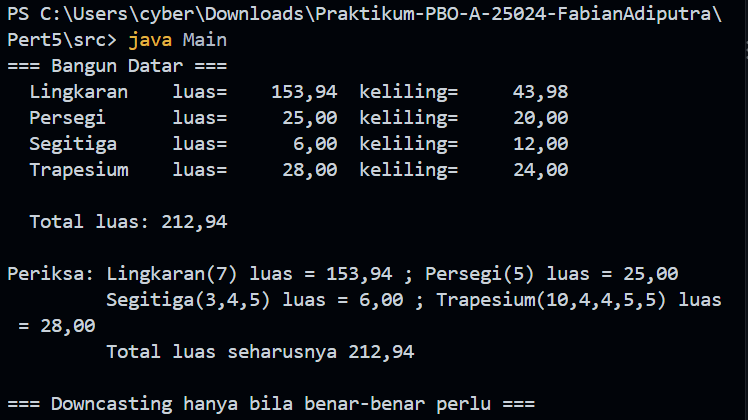
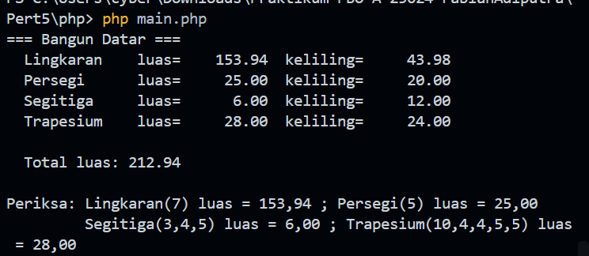

# Praktikum PBO — Pertemuan 5

## Biodata Saya

| Keterangan | Data |
|---|---|
| Nama | Fabian Adiputra |
| NIM | 4525210024 |
| Kelas | PBO A |

## Tugasnya Apa

Pada pertemuan ini, saya mempelajari polimorfisme melalui program bangun datar
dan hierarki notifikasi. Kelas abstrak `BangunDatar` menetapkan kontrak method
luas dan keliling, kemudian setiap kelas turunan mengimplementasikan rumusnya
masing-masing. Program menyimpan beberapa bentuk dalam daftar bertipe induk
dan memanggil method tanpa perlu mengetahui tipe objek satu per satu.

Bangun datar yang digunakan adalah lingkaran, persegi, segitiga, dan trapesium.
Program memvalidasi ukuran agar bernilai positif; sisi segitiga juga harus
memenuhi syarat pembentukan segitiga. Latihan tambahan membandingkan
pendekatan anti-pattern berbasis pemeriksaan tipe dengan pendekatan
polimorfik. Di PHP, latihan notifikasi menggunakan kelas abstrak `Notifikasi`
dengan turunan Email, SMS, dan WhatsApp.

## Source Tugas yang Saya Kerjakan

### File `BangunDatar.java`

#### Sebelum

Kerangka tugas meminta dibuat kelas induk abstrak yang menetapkan kontrak
untuk menghitung luas dan keliling, serta menyediakan nama dan representasi
teks bangun datar.

#### Setelah

Source: [src/BangunDatar.java](src/BangunDatar.java)

Kelas abstrak ini mendeklarasikan method `luas()` dan `keliling()` agar wajib
diimplementasikan oleh kelas turunan. Method `toString()` memanggil kedua
method tersebut, sehingga hasil perhitungan mengikuti implementasi objek
yang sedang digunakan.

### File kelas bangun datar Java

#### Sebelum

Setiap kelas turunan perlu melengkapi rumus luas dan kelilingnya sendiri,
memvalidasi ukuran dari constructor, dan mewarisi kelas `BangunDatar`.

#### Setelah

- [src/Lingkaran.java](src/Lingkaran.java) menghitung luas dan keliling dengan
  konstanta `Math.PI`.
- [src/Persegi.java](src/Persegi.java) menghitung luas dan keliling dari
  panjang sisi.
- [src/Segitiga.java](src/Segitiga.java) memvalidasi tiga sisi, menghitung
  luas dengan rumus Heron, dan menghitung keliling dengan menjumlahkan sisi.
- [src/Trapesium.java](src/Trapesium.java) menghitung luas berdasarkan sisi
  sejajar dan tinggi, serta keliling dari keempat sisinya.

Constructor masing-masing kelas menolak ukuran yang tidak positif atau tidak
terbatas. Constructor segitiga juga menolak sisi yang tidak memenuhi
ketaksamaan segitiga.

### File `Main.java`

#### Sebelum

Program uji disusun untuk menambahkan objek bangun datar ke dalam array
bertipe `BangunDatar[]`. Perulangan untuk menampilkan objek dan menjumlahkan
luas menggunakan method polimorfik.

#### Setelah

Source: [src/Main.java](src/Main.java)

Daftar berisi lingkaran, persegi, segitiga, dan trapesium. Program mencetak
luas serta keliling tiap objek, menghitung total luas **212,94**, dan
menunjukkan downcasting hanya saat membutuhkan jari-jari lingkaran.

### File `BangunDatar.php` dan `main.php`

#### Sebelum

Pada versi PHP, tugasnya adalah membuat hierarki abstrak yang serupa dengan
Java, mengimplementasikan rumus bangun datar, lalu menguji objek-objeknya
dengan pemanggilan method melalui tipe induk.

#### Setelah

- [php/BangunDatar.php](php/BangunDatar.php) memuat kelas abstrak `BangunDatar`
  beserta turunan Lingkaran, Persegi, Segitiga, dan Trapesium.
- [php/main.php](php/main.php) membuat daftar objek, mencetak luas dan
  keliling, lalu menjumlahkan luasnya.

### File `AntiPattern.java`

#### Sebelum

Bahan latihan menunjukkan cara menghitung luas dengan menguji tipe objek
(`instanceof`) dan menambahkan cabang kondisi untuk setiap bentuk baru.

#### Setelah

Source: [src/AntiPattern.java](src/AntiPattern.java)

Method `hitungLuas()` memeriksa tipe setiap objek dan menghitung luas di
dalam cabang masing-masing. Contoh ini menjadi pembanding untuk melihat bahwa
penambahan bentuk baru memerlukan perubahan pada method tersebut.

### File `AntiPatternRefaktor.java`

#### Sebelum

Tugas refaktor meminta logika perhitungan dipindahkan ke masing-masing jenis
bangun, bukan ditentukan lewat pemeriksaan tipe terpusat.

#### Setelah

Source: [src/AntiPatternRefaktor.java](src/AntiPatternRefaktor.java)

Interface `Bangun` mendeklarasikan method `luas()`. Lingkaran, persegi, dan
segitiga mengimplementasikan method tersebut, lalu program menjumlahkan luas
melalui tipe interface. Dengan data uji yang sama, total versi anti-pattern
dan polimorfik sama-sama **184,94**.

### File `notifikasi.php`

#### Sebelum

Latihan meminta dibuat kelas abstrak `Notifikasi`, turunan untuk tiga saluran
komunikasi, dan fungsi pengiriman massal tanpa pemeriksaan tipe.

#### Setelah

Source: [php/notifikasi.php](php/notifikasi.php)

Kelas `Notifikasi` menyimpan tujuan dan menetapkan kontrak `kirim()` serta
`saluran()`. Kelas Email, SMS, dan WhatsApp memberikan format pengiriman
masing-masing. Fungsi `kirimSemua()` mengirim pesan dengan memanggil
`kirim()` pada setiap objek dalam daftar tanpa `instanceof`, `match`, atau
`switch`.

## Hasil Keseluruhan

### Hasil program Java

### Hasil program PHP

## Kesimpulan

Dari praktikum ini, saya memahami bahwa polimorfisme memungkinkan objek
berbeda diproses melalui kontrak method yang sama, sementara tiap kelas
menentukan implementasinya sendiri. Cara ini mengurangi pemeriksaan tipe dan
membuat program lebih mudah dikembangkan ketika jenis bangun datar atau
saluran notifikasi baru ditambahkan.
