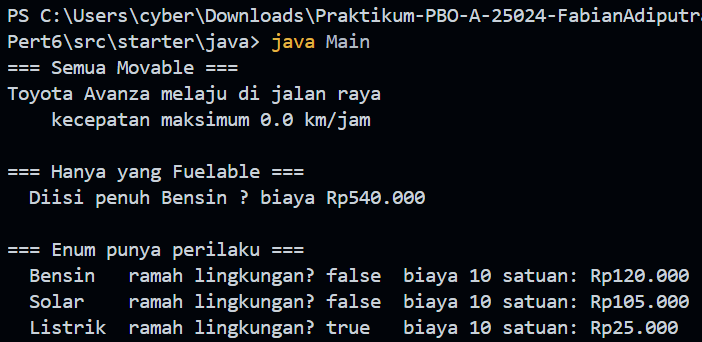

# Praktikum PBO — Pertemuan 6

## Biodata Saya

| Keterangan | Data |
|---|---|
| Nama | Fabian Adiputra |
| NIM | 4525210024 |
| Kelas | PBO A |

## Tugasnya Apa

Pada pertemuan ini, saya mempelajari abstraksi dalam PBO melalui abstract
class, interface, enum, dan trait. Contoh program menggunakan kendaraan untuk
menunjukkan bahwa satu objek dapat memiliki kemampuan berbeda: kendaraan
dapat bergerak, sebagian kendaraan dapat diisi bahan bakar, dan objek yang
tidak berada dalam hierarki kendaraan tetap dapat menggunakan perilaku
bersama melalui trait.

Materi yang diterapkan meliputi:

- `Kendaraan` sebagai abstract class yang menyimpan data umum dan menetapkan
  kontrak jumlah roda.
- `Movable` dan `Fuelable` sebagai interface yang memisahkan kemampuan
  bergerak dan mengisi bahan bakar.
- `TipeBahanBakar` sebagai daftar nilai bahan bakar dengan perilaku seperti
  label, harga, biaya pengisian, dan status ramah lingkungan.
- `Loggable` sebagai trait PHP yang dapat digunakan oleh kelas berbeda.
- Pemanggilan method melalui tipe kontrak, bukan bergantung pada kelas
  konkret.

## Source Tugas yang Saya Kerjakan

### File `Kendaraan.java`

#### Sebelum

Kerangka tugas meminta dibuat kelas abstrak untuk menampung data dan perilaku
umum kendaraan, menghitung umur kendaraan, dan menetapkan kontrak jumlah
roda.

#### Setelah

Source: [src/starter/java/Kendaraan.java](src/starter/java/Kendaraan.java)

Kelas abstrak ini menyimpan merek dan tahun kendaraan. Method `umur()` tidak
menghasilkan umur negatif, `jumlahRoda()` menjadi kontrak untuk kelas turunan,
dan `toString()` menyusun informasi umum kendaraan.

### File `Movable.java` dan `Fuelable.java`

#### Sebelum

Tugas meminta kemampuan kendaraan dipisahkan menjadi kontrak yang berbeda.
Dengan begitu, objek yang dapat bergerak tidak harus selalu dapat diisi bahan
bakar.

#### Setelah

- [src/starter/java/Movable.java](src/starter/java/Movable.java) menetapkan
  method untuk bergerak dan mendapatkan kecepatan maksimum. Default method
  `ringkasanGerak()` membuat ringkasan kecepatan.
- [src/starter/java/Fuelable.java](src/starter/java/Fuelable.java) menetapkan
  method untuk mengisi bahan bakar, kapasitas tangki, dan tipe bahan bakar.

Pemisahan ini memperlihatkan bahwa interface mendefinisikan kemampuan yang
diperlukan oleh pemanggil, bukan identitas suatu objek.

### File `TipeBahanBakar.java`

#### Sebelum

Kerangka tugas meminta enum berisi jenis bahan bakar beserta label dan harga,
serta method untuk menghitung biaya pengisian dan menentukan apakah bahan
bakar ramah lingkungan.

#### Setelah

Source: [src/starter/java/TipeBahanBakar.java](src/starter/java/TipeBahanBakar.java)

Enum menyediakan nilai BENSIN, SOLAR, dan LISTRIK. Masing-masing mempunyai
label dan harga per satuan. Method `biayaPengisian()` menghitung biaya,
sedangkan `ramahLingkungan()` bernilai benar untuk LISTRIK.

### File `Mobil.java`

#### Sebelum

Kelas mobil perlu mewarisi data umum kendaraan dan mengimplementasikan
kontrak `Movable` serta `Fuelable`, termasuk mengelola jumlah bahan bakar di
dalam tangki.

#### Setelah

Source: [src/starter/java/Mobil.java](src/starter/java/Mobil.java)

Kelas `Mobil` mewarisi `Kendaraan` dan mengimplementasikan kedua interface.
Kelas ini memiliki kapasitas dan isi tangki, melaporkan tipe bahan bakar
bensin, serta menyediakan perilaku bergerak dan kecepatan maksimum.

### File `Main.java`

#### Sebelum

Program utama digunakan untuk menguji objek berdasarkan interface yang
diimplementasikan. Method pengisian penuh menerima parameter bertipe
`Fuelable`, sehingga tidak terikat pada kelas `Mobil`.

#### Setelah

Source: [src/starter/java/Main.java](src/starter/java/Main.java)

Method `isiPenuh()` mengisi tangki sesuai kapasitas dan menghitung biayanya.
Program juga menampilkan perilaku enum untuk semua tipe bahan bakar.
Bagian daftar kendaraan yang dapat bergerak menunjukkan pemanggilan method
melalui interface `Movable`.

### File `abstraksi.php`

#### Sebelum

Implementasi PHP diminta memodelkan abstract class, interface, enum, dan
trait, kemudian menggunakannya untuk kelas kendaraan dan pesanan.

#### Setelah

Source: [src/starter/php/abstraksi.php](src/starter/php/abstraksi.php)

File ini memuat interface `Movable` dan `Fuelable`, abstract class
`Kendaraan`, kelas `Mobil` dan `Sepeda`, trait `Loggable`, serta kelas
`Pesanan`. Untuk tipe bahan bakar, source menyediakan perilaku label, harga,
biaya pengisian, dan status ramah lingkungan.

**Catatan kompatibilitas:** PHP CLI yang digunakan adalah PHP 8.0.8. Karena
native enum dan properti `readonly` memerlukan versi PHP yang lebih baru,
`TipeBahanBakar` diimplementasikan sebagai kelas singleton dengan daftar
nilai terbatas, dan properti ditulis dengan sintaks yang didukung PHP 8.0.
Method `cases()` mempertahankan daftar jenis bahan bakar yang digunakan
program.

### File `main.php`

#### Sebelum

Program utama PHP menguji pemanggilan berdasarkan interface dan memeriksa
bahwa sepeda yang hanya `Movable` tidak dapat diperlakukan sebagai objek
`Fuelable`.

#### Setelah

Source: [src/starter/php/main.php](src/starter/php/main.php)

Program membuat mobil dan sepeda, menampilkan kemampuan gerak, lalu mengisi
bahan bakar mobil. Ketika sepeda diuji sebagai `Fuelable`, program menangani
`TypeError` dan mencatat hasilnya ke file `keputusan.md`. Program juga
menampilkan biaya untuk setiap jenis bahan bakar dan menggunakan trait
`Loggable` pada mobil serta pesanan.

## Hasil Keseluruhan

### Screenshot hasil program Java

### Ringkasan hasil program PHP

Program menampilkan bahwa mobil dapat diisi penuh dengan bensin, sedangkan
sepeda tidak memenuhi kontrak `Fuelable`. Contoh hasil perhitungan biaya untuk
10 satuan bahan bakar:

| Jenis bahan bakar | Ramah lingkungan | Biaya |
|---|---:|---:|
| Bensin | Tidak | Rp120.000 |
| Solar | Tidak | Rp105.000 |
| Listrik | Ya | Rp25.000 |

Program PHP juga mencatat aktivitas mobil dan pesanan menggunakan trait
`Loggable`.

## Kesimpulan

Melalui tugas ini, saya memahami bahwa abstract class digunakan untuk
menyediakan data dan perilaku dasar bersama, sedangkan interface menetapkan
kontrak kemampuan yang dapat diterapkan secara terpisah. Enum membatasi
pilihan nilai sekaligus dapat memiliki perilaku, dan trait memungkinkan
perilaku dipakai oleh kelas yang tidak memiliki hubungan pewarisan. Pemisahan
abstraksi tersebut membantu kode lebih terstruktur dan mudah dikembangkan.
